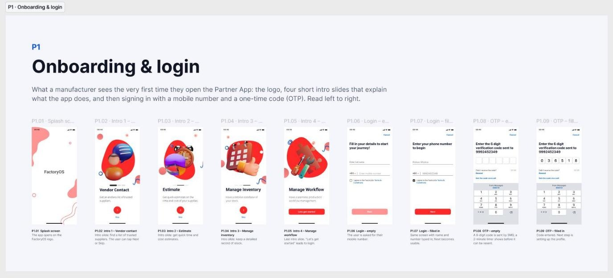
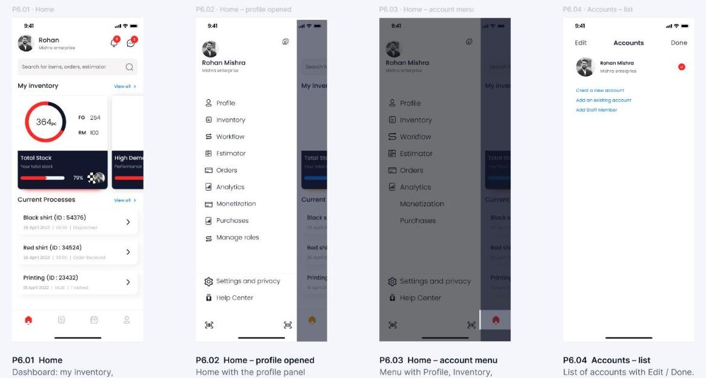
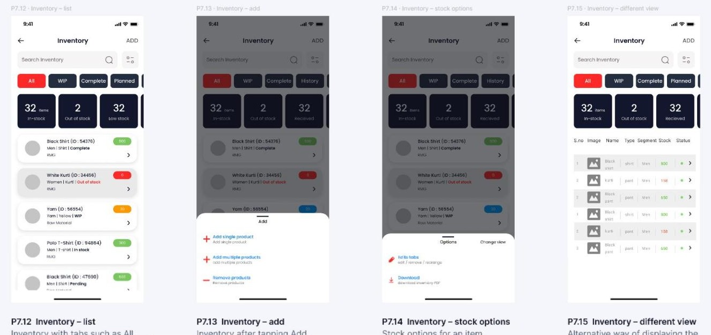
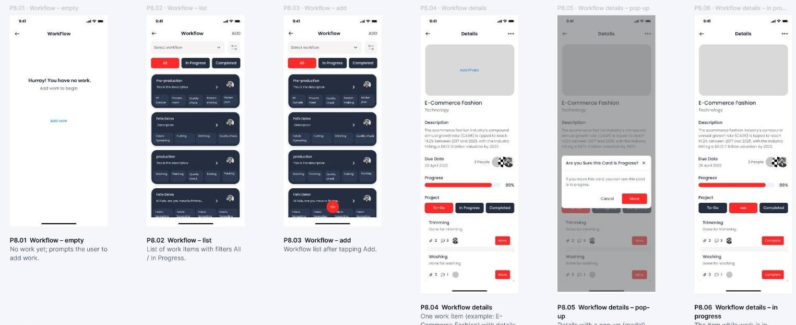
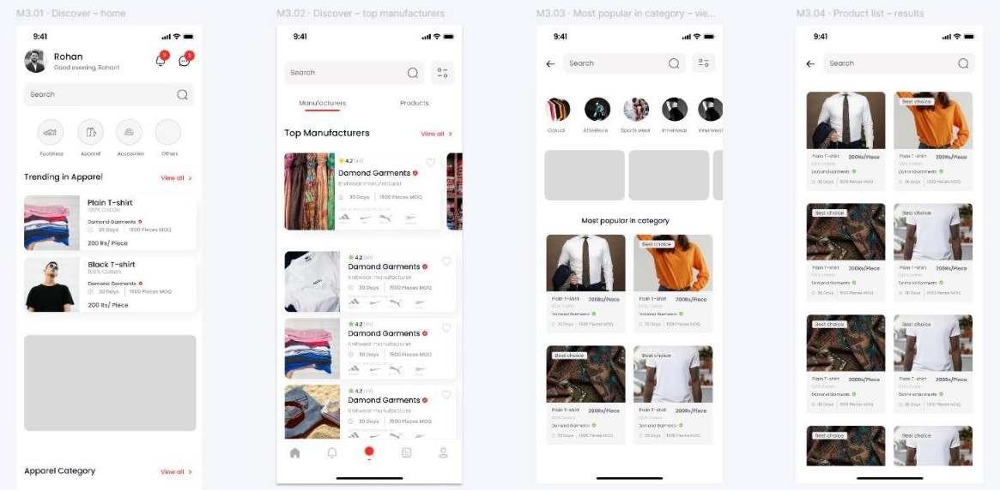
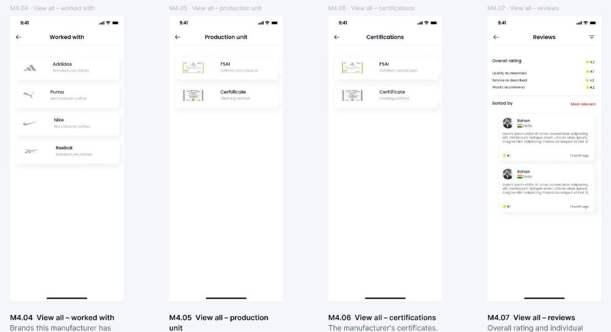
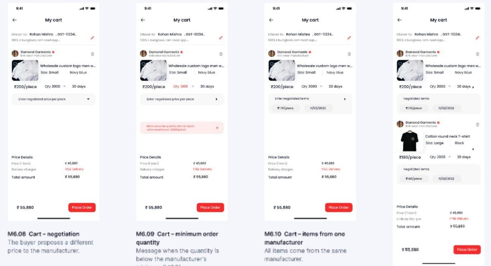

# Factory OS — app design, organised and documented

Design file for **Factory OS (FOS)**, a B2B platform from KonnectBox that connects garment and footwear manufacturers with the brands that buy from them. I worked on it as a Product Management Intern (June–July 2022).

This repo is the write-up. The design itself lives in Figma:

**[Open the Figma file](https://www.figma.com/design/7MFIAZ83eMDVa6mihkblpO/FOS_Final_Design--Copy-?node-id=1-2773)** (view-only)

## The two apps

| | Partner App | Marketplace App ("FOS Outlet") |
|---|---|---|
| **Used by** | Manufacturers (factories) | Brands (buyers) |
| **What they do** | Set up a factory profile, record stock, track production work, manage staff, chat | Discover manufacturers and products, negotiate price, place wholesale orders, follow them |
| **Screens** | 97 | 54 |

A third page holds a **design review**: 11 screenshots of the app as built, each with the fixes needed, plus 11 screens redrawn in response.

## How the file is organised

The file is laid out so that someone with no design background can follow it.

- **Pages are named for their audience**: `1 · Partner App (for manufacturers)`, `2 · Marketplace App (for brands)`, `3 · Design review (feedback)`.
- **Screens are grouped into numbered sections**, stacked in the order a user meets them. Each section has a title and a short plain-language description.
- **Every screen has a code and a one-line caption.** `P7.12` means Partner App, section 7, screen 12. Use the code when discussing a screen.
- **A "Start here" guide** at the top of each page explains what FOS is, how to read the file, and a glossary (OTP, MOQ, GST, toast, empty state).
- **An archive box** at the bottom of a page keeps leftover pieces, so nothing from the original was deleted.

### Partner App sections

| Code | Section | Screens |
|---|---|---|
| P1 | Onboarding & login | 9 |
| P2 | New user form – Apparel | 18 |
| P3 | New user form – Footwear | 6 |
| P4 | Profile & factory setup – newer visual style | 10 |
| P5 | Home – first-time setup & switching factory | 5 |
| P6 | Home & accounts | 5 |
| P7 | Inventory & products | 18 |
| P8 | Workflow management | 10 |
| P9 | Staff & roles | 5 |
| P10 | Chat | 2 |
| P11 | Notifications | 2 |
| P12 | Settings & profile | 2 |
| P13 | Toasts & feedback messages | 5 |

### Marketplace App sections

| Code | Section | Screens |
|---|---|---|
| M1 | Onboarding & sign-up | 9 |
| M2 | Login help & terms | 6 |
| M3 | Discover & search | 7 |
| M4 | Manufacturer profile | 9 |
| M5 | Product details | 3 |
| M6 | Cart & checkout | 14 |
| M7 | My orders | 4 |
| M8 | Website (desktop) – search by manufacturer | 2 |

## Selected screens

**Partner App — home and account menu**

**Partner App — inventory**

**Partner App — production workflow**

**Marketplace App — discover manufacturers and products**

**Marketplace App — manufacturer profile**

**Marketplace App — cart with price negotiation and minimum order quantity**

## Open questions in the file

- The manufacturer's first-time setup exists in three versions (P2 apparel, P3 footwear, P4 newer style). P4 matches the screens redrawn after the design review, so it is probably the latest.
- Some screens still carry placeholder copy ("Lorem ipsum") and sample names.

## Credits

Factory OS is a KonnectBox product; the designs are shown here as portfolio work. More about my role is on my [portfolio](https://meghanigwal.github.io/#factory-os).
